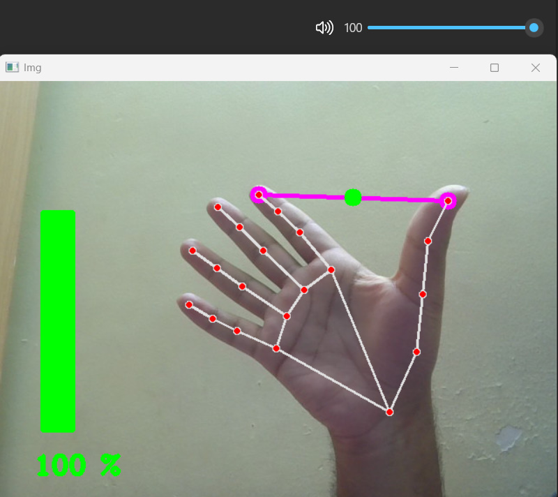
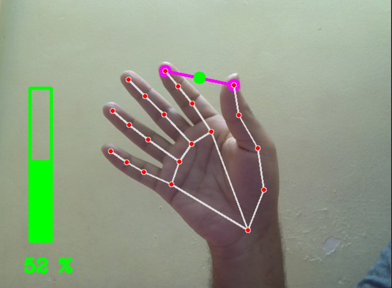

# Gesture Volume Control

A Python application that uses hand gestures to control your system’s audio volume in real time.
Built with OpenCV for video processing, MediaPipe for hand landmark detection, and Pycaw for Windows audio control.

# ✨ Features

📹 Real-time detection of hand movements via webcam  
🖐 Thumb–index finger distance mapping to volume levels  
🔊 OS-level volume adjustment without touching your keyboard/mouse  
⚡ Smooth and responsive performance (~30 FPS)  
🖥 Designed for Windows systems (Pycaw dependency)  

# 🛠 Tech Stack
Python 3.x  
OpenCV – Image & video processing  
MediaPipe – Hand landmark detection  
NumPy – Numerical computations  
Pycaw – Windows audio control  

# 📦 Installation

- Clone the repository  
git clone https://github.com/yourusername/gesture-volume-control.git  
cd gesture-volume-control  

# Install dependencies
pip install opencv-python mediapipe numpy pycaw comtypes

# ▶ Usage
Make an OK gesture (thumb and index finger apart) to set the volume  
Move fingers closer = decrease volume  
Move fingers apart = increase volume  
Press Q to exit  

# 📸 Demo

